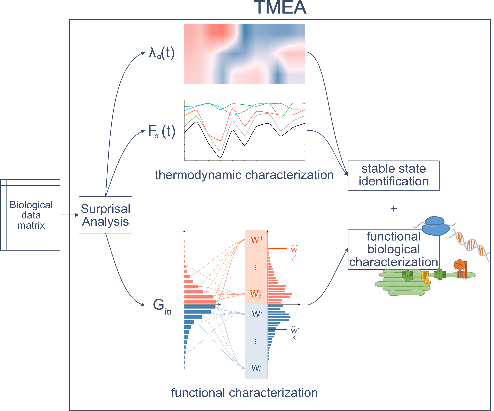
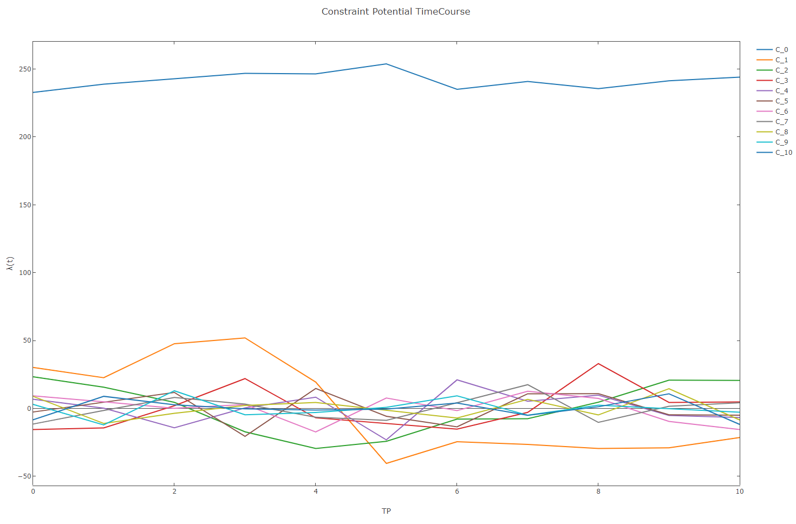
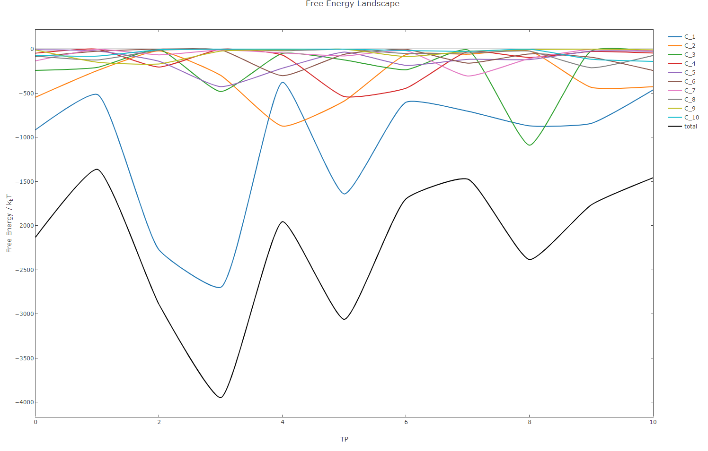

# Introduction

The objective of gene set enrichment analysis (GSEA) in modern biological studies is to identify functional 
profiles in huge sets of biomolecules generated by high throughput measurements of genes, transcripts, metabolites, 
and proteins. GSEA is based on a two-stage process using classical statistical analysis to score the input data and 
subsequent testing for overrepresentation of the enrichment score within a given functional coherent set. 
However, enrichment scores computed by different methods are merely statistically motivated and often elusive to 
direct biological interpretation. 

Here, we propose a novel approach, called Thermodynamically Motivated Enrichment Analysis (TMEA), to account for the 
energy investment in biological relevant processes. Therefore, TMEA is based on surprisal analysis, that offers a 
thermodynamic-free energy-based representation of the biological steady state and of the biological change. 
The contribution of each biomolecule underlying the changes in free energy is used in a Monte Carlo resampling 
procedure resulting in a functional characterization directly coupled to the thermodynamic characterization of 
biological responses to system perturbations.

This package is in an experimental stage, there may be bugs, and some advanced functionality (e.g. producing plots from the result types) are missing (at least at the moment). 



# Installation

This repository is home of the library TMEA, which we created from the scripts we used in our currently in-review paper.

the package is available on nuget:

https://www.nuget.org/packages/TMEA/0.0.1-alpha

alternatively, clone this repo and run `fake.cmd` or `fake.sh` (requires dotnet sdk >= 3.1.302)


# Usage

1. Include the lapack folder to your PATH variable, either for the fsi session or on your systems level. The folder is located in the nuget package under `./Netlib_LAPACK`

2. Reference this library and its dependencies.

3. We strongly recommend to register fsi printers for Deedle, the dataframe library we use in this project. There is a `Deedle.fsx` file located in the Deedle nuget package which will take care of that if you `#load` it.

4. A simple pipeline to perform TMEA on time series data looks like this:

    - load the data using the `TMEA.IO.readDataFrame` function (data is assumed to be measurements(timepoints) in the columns, biolocal entities (e.g. transcripts) in the rows)
    - perform Surprisal Analysis on the data matrix using the `` function
    - Use our Monte Carlo sampling procedure on the patterns (constraints) identified by surprisal analysis to identify overrepresented gene sets based on their sum of weights in the constraints using functions from the `TMEA.MonteCarlo` module.
    - here is a full script example:

```F#
open TMEA.IO
open TMEA.SurprisalAnalysis
open TMEA.MonteCarlo
open TMEA.Frames

let tmeaResult = 
    readDataFrame 
        "TranscriptIdentifier" //Column to index the data frame with, the only non numerical column allowed in the dataset
        "\t"
        @"pathToMyData.txt"
|> fun f ->
    f 
    |> TMEA.SurprisalAnalysis.computeOfDataFrame // compute surprisal analysis
    |> TMEA.MonteCarlo.computeOfSARes 
        true
        myAnnotationMap // am map that contains the ontology annotations for our dataset
        (f.RowKeys |> Array.ofSeq) 
        99 //iterations (the more the higher the pvalue resolution, minimum pvalue possible is 1/iterations)
    |> TMEA.Frames.createTMEACharacterizationTable 
        5 // filter for bin sizes considered too small
        id // optional name converter for ontologies (e.g. converting reference numbers to human readable names)

```

# Plots

Currently, the following plots are provided by the package:

**Surprisal Analysis:**

Given the following example input:

```F#
let data =
    TMEA.IO.readDataFrame 
        "TranscriptIdentifier" 
        "\t"
        @"path/to/data.txt"
    |> Frame.toArray2D
    |> JaggedArray.ofArray2D
    |> JaggedArray.transpose

let SaRes = 
    TMEA.IO.readDataFrame 
        "TranscriptIdentifier" 
        "\t"
        @"path/to/data.txt"
    |> TMEA.SurprisalAnalysis.computeOfDataFrame
```

 - `TMEA.Plots.SurprisalAnalysis.plotConstraintTimecourses` plots the constraint potential time courses of the given surprisal analysis result:

    ```F#
    SaRes
    |> TMEA.Plots.SurprisalAnalysis.plotConstraintTimecourses true //true -> will use style presets
    ```

    

 - `Plots.SurprisalAnalysis.plotFreeEnergyLandscape` plots the free energy landscape of the given surprisal analysis result:

    ```
    SaRes
    |> TMEA.Plots.SurprisalAnalysis.plotFreeEnergyLandscape true data
    ```

    

# License acknowlegments

This library contains [Netlib LAPACK](http://www.netlib.org/lapack/) binaries compiled from source, thanks to all the authors of it:
    
    Anderson, E. and Bai, Z. and Bischof, C. and Blackford, S. and Demmel, J. and Dongarra, J. and
    Du Croz, J. and Greenbaum, A. and Hammarling, S. and McKenney, A. and Sorensen, D.

