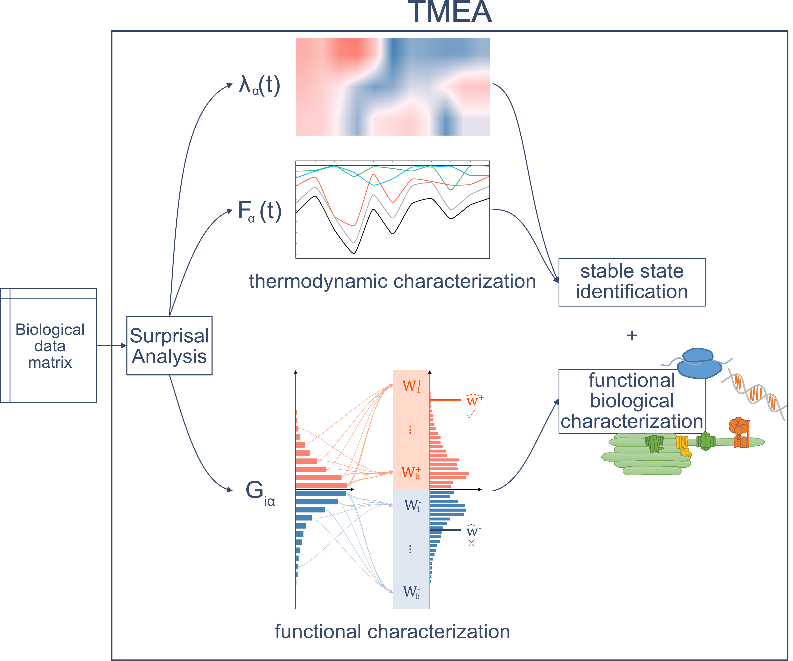
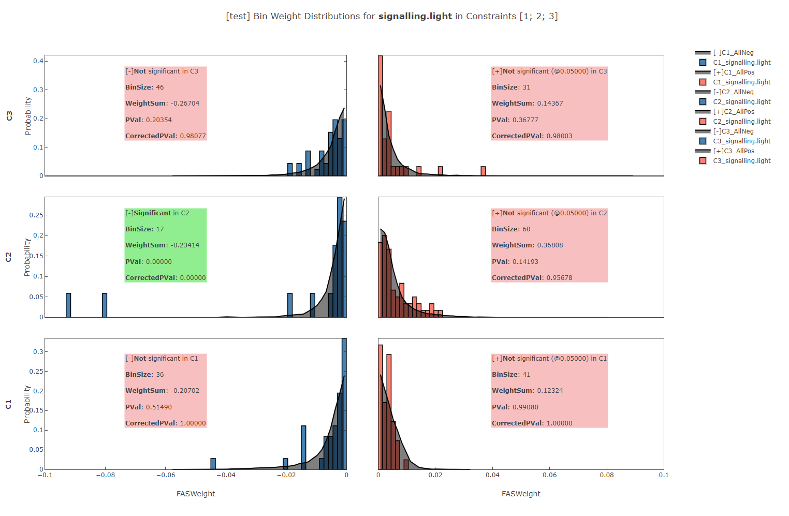
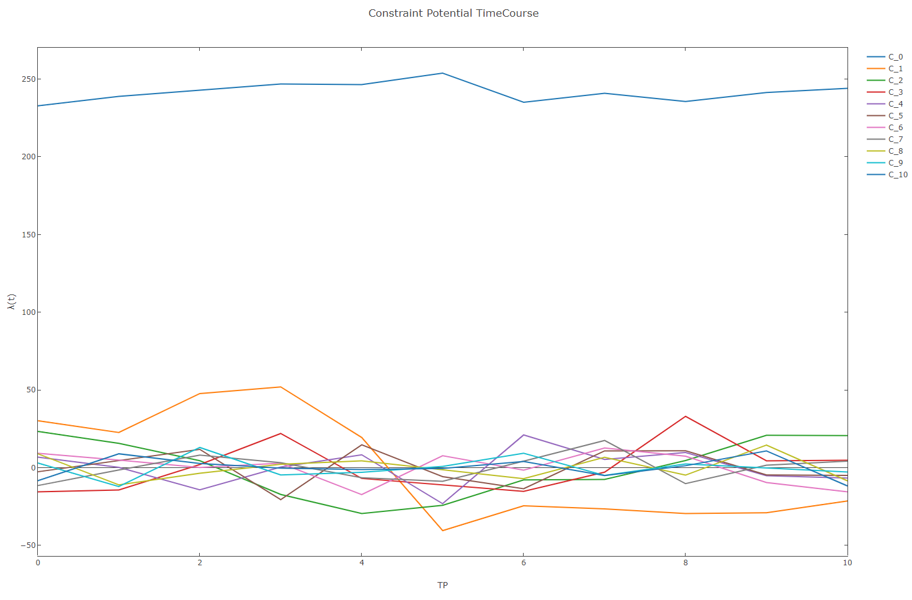
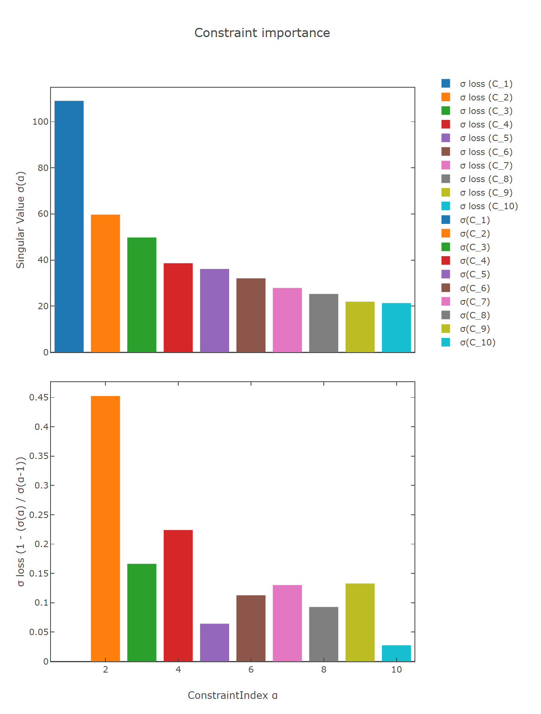
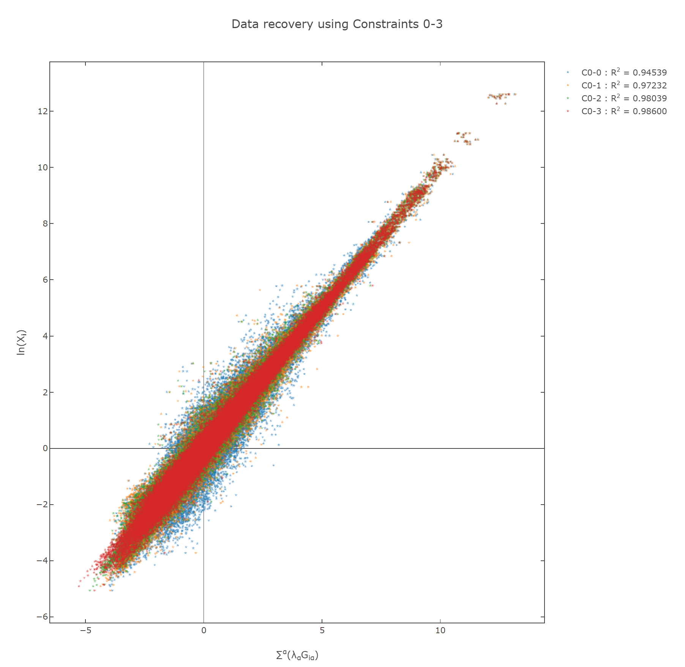
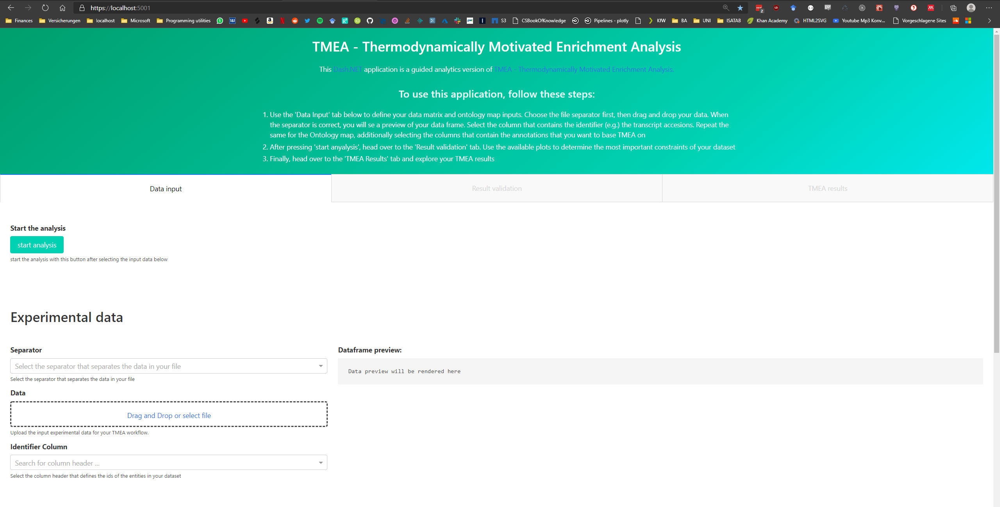

[](https://www.nuget.org/packages/TMEA)
[](https://doi.org/10.3390/e22091030)

This repository is home of the framework TMEA (**T**hermodynamically **M**otivated **E**nrichment **A**nalysis), which we created from the scripts we used in our 2020 [Entropy paper]( https://doi.org/10.3390/e22091030)

Find the authors on github: [Kevin Schneider](https://github.com/kMutagene) (1), [Benedikt Venn](https://github.com/bvenn) (1), [Timo Mühlhaus](https://github.com/muehlhaus)

- (1) : These authors contributed **equally**.

If you use this package in your research, please cite it. Citation formats are available at the [original article page](https://www.mdpi.com/1099-4300/22/9/1030#cite)

alternatively, here is an example citation:

> Schneider K, Venn B, Mühlhaus T. TMEA: A Thermodynamically Motivated Framework for Functional Characterization of Biological Responses to System Acclimation. Entropy. 2020; 22(9):1030.

_This package is in an early beta stage, there may be bugs. Issues and PRs are greatly appreciated!_ 

<!-- TOC -->

- [Introduction](#introduction)
- [Installation](#installation)
- [Usage](#usage)
- [Plots](#plots)
    - [Functionally Annotated Set (FAS) weight distributions](#functionally-annotated-set-fas-weight-distributions)
    - [Potential Time Course:](#potential-time-course)
    - [Free Energy Landscape:](#free-energy-landscape)
    - [Constraint importance:](#constraint-importance)
    - [Data recovery:](#data-recovery)
- [TMEA.Dash](#tmeadash)
    - [Usage](#usage-1)
- [License acknowlegments](#license-acknowlegments)

<!-- /TOC -->

## Introduction

The objective of gene set enrichment analysis (GSEA) in modern biological studies is to identify functional 
profiles in huge sets of biomolecules generated by high throughput measurements of genes, transcripts, metabolites, 
and proteins. GSEA is based on a two-stage process using classical statistical analysis to score the input data and 
subsequent testing for overrepresentation of the enrichment score within a given functional coherent set. 
However, enrichment scores computed by different methods are merely statistically motivated and often elusive to 
direct biological interpretation. 

Here, we propose a novel approach, called Thermodynamically Motivated Enrichment Analysis (TMEA), to account for the 
energy investment in biological relevant processes. Therefore, TMEA is based on surprisal analysis, that offers a 
thermodynamic-free energy-based representation of the biological steady state and of the biological change. 
The contribution of each biomolecule underlying the changes in free energy is used in a Monte Carlo resampling 
procedure resulting in a functional characterization directly coupled to the thermodynamic characterization of 
biological responses to system perturbations.



## Installation

For instructions on how to install F#, please head [here(Windows)](https://fsharp.org/use/windows/) , [here(MAC)](https://fsharp.org/use/mac/) or [here(Linux)](https://fsharp.org/use/linux/)

the package itself is available on nuget: https://www.nuget.org/packages/TMEA

alternatively, clone this repo and run `fake.cmd` or `fake.sh` (requires dotnet sdk >= 3.1.302)


## Usage

1. Include the lapack folder to your PATH variable, either for the fsi session or on your systems level. The folder is located in the nuget package under `./Netlib_LAPACK`

2. Reference this library and its dependencies.

3. We strongly recommend to register fsi printers for Deedle, the dataframe library we use in this project. There is a `Deedle.fsx` file located in the Deedle nuget package which will take care of that if you `#load` it.

4. A simple pipeline to perform TMEA on time series data looks like this:

    ```F#
    open TMEA
    open TMEA.SurprisalAnalysis
    open TMEA.MonteCarlo
    open TMEA.Frames
    open TMEA.Plots

    let annotationMap : Map<string,string[]> = ... // We assume you have ontology annotations for your dataset

    let tmeaRes = 
        IO.readDataFrame 
            "TranscriptIdentifier" // The column of the data table that contains your entity identifiers
            "\t" // separator for the input file
            "path/to/your/raw/data.txt"
        |> Analysis.computeOfDataFrame 
            Analysis.standardTMEAParameters //using custom parameters you can change verbosity, bootstrap iterations, and the annotation used for unannotated entities
            annotationMap
    ```

## Plots

All plot functions have a `generate*` analog, which generates the Chart object without rendering it (in case you want to fine tune styles etc.).
Currently, the following plots are provided by the package:

All charting functions are extension methods of the `TMEAResult` type. Given the example script above, you can visualize the results as:

### Functionally Annotated Set (FAS) weight distributions

 - `plotFASWeightDistribution` is an exploratory plot that visualizes the overall weight distributions of the given TMEA Characterizations, and adds detailed weight distributions of the FAS of interest on top of that. additionally, annotations on the respective subplots show useful information about the FAS characterization.

    ```F#
    tmeaRes
    |> TMEAResult.plotFASWeightDistribution 
        true //use style presets
        0.05 //significance threshold for (corrected!) p values
        [1;2;3] //constraints to plot
        "signalling.light" //name of the FAS
    ```

    

### Potential Time Course:

 - `plotConstraintTimecourses` plots the constraint potential time courses of the given TMEA result:

    ```F#
    tmeaRes
    |> TMEAResult.plotConstraintTimecourses true //true -> will use style presets
    ```

    

 - `plotPotentialHeatmap` is a more visually pleasing version of above plot (it omits the baseline state per default):

    ```F#
    tmeaRes
    |> TMEAResult.plotPotentialHeatmap true
    ```

    

### Free Energy Landscape:

 - `plotFreeEnergyLandscape` plots the free energy landscape of the TMEA result:

    ```
    tmeaRes
    |> TMEAResult.plotFreeEnergyLandscape true
    ```

    

### Constraint importance:

 - `plotConstraintImportance`: given the TMEA result, plots the singular values of all constraints (except the baseline state) and the 'importance loss' between them. 

    ```
    tmeaRes
    |> TMEAResult.plotConstraintImportance true
    ```

    

### Data recovery:

 - `plotDataRecovery`: given the TMEA result, plots the gradual reconstruction of the original data when using only n (in the example below, n = 3) constraints from the given TMEA result:

    ```
    tmeaRes
    |> TMEAResult.plotDataRecovery true 3 
    ```

    

## TMEA.Dash

TMEA.Dash is a guided analytics application for TMEA using [Dash.NET](https://www.github.com/plotly/Dash.NET). 

### Usage

- Clone this repository

- install dotnet sdk >= 3.1.302

- in a shell, navigate to `src/TMEA.Dash`

- use `dotnet run` to start the application. Open a browser and head to https://localhost:5001/

- you should see the following interface:



## License acknowlegments

This library contains [Netlib LAPACK](http://www.netlib.org/lapack/) binaries compiled from source, thanks to all the authors of it:
    
    Anderson, E. and Bai, Z. and Bischof, C. and Blackford, S. and Demmel, J. and Dongarra, J. and
    Du Croz, J. and Greenbaum, A. and Hammarling, S. and McKenney, A. and Sorensen, D.

